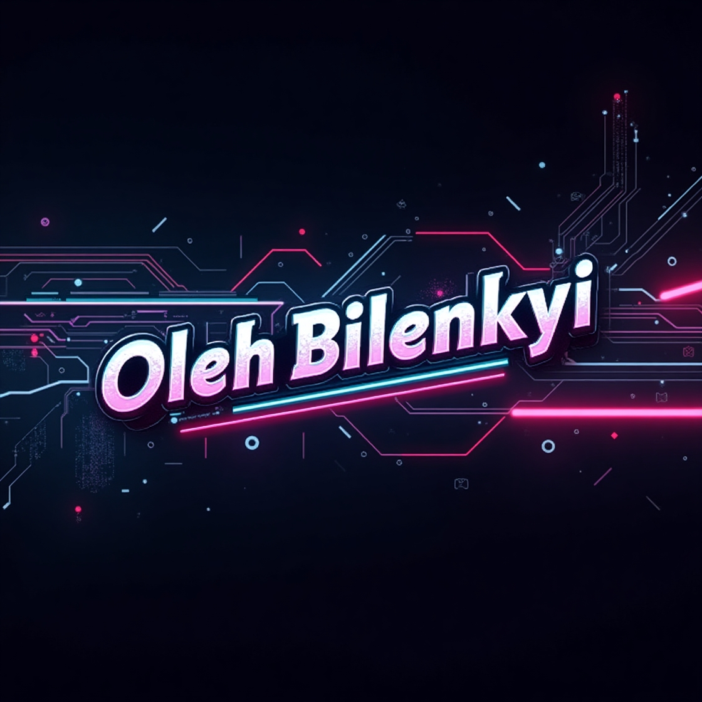

<!--
**OlehBilenkyi/OlehBilenkyi** is a ✨ _special_ ✨ repository because its `README.md` (this file) appears on your GitHub profile.

Here are some ideas to get you started:

- 🔭 I’m currently working on ...
- 🌱 I’m currently learning ...
- 👯 I’m looking to collaborate on ...
- 🤔 I’m looking for help with ...
- 💬 Ask me about ...
- 📫 How to reach me: ...
- 😄 Pronouns: ...
- ⚡ Fun fact: ...
-->

<h1 align="center">
  
</h1>

### ⚡ Tech Stack

<!--

 
-->

### 📊 GitHub Stats

  

### 🚀 Featured Projects

- 🔥 [Проект 1](https://github.com/OlehBilenkyi/Project1)
- ⚡ [Проект 2](https://github.com/OlehBilenkyi/Project2)

### 📬 Contact Me:

